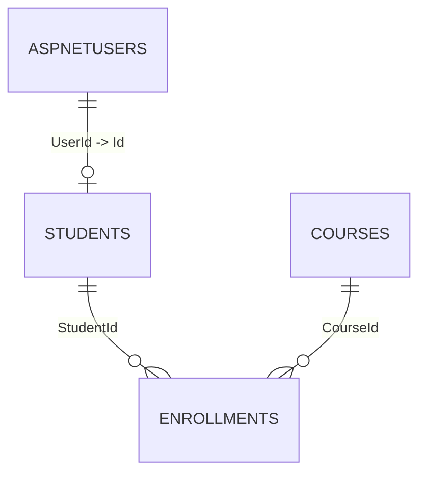

# Modelagem de Dados (DDD + EF Core)

## Relacao com Identity
- `AspNetUsers` (Identity) 1..0/1 `Students`
- `Students.UserId` referencia `AspNetUsers.Id` (FK unica)
- Decisao: `Student` como entidade propria com dados de dominio e FK para usuario autenticavel do Identity.

## Diagrama simples

## Tabelas e colunas

### `Courses`
- `Id` `uniqueidentifier` PK
- `Title` `nvarchar(200)` NOT NULL
- `Description` `nvarchar(1000)` NULL
- `Category` `nvarchar(80)` NOT NULL
- `WorkloadHours` `int` NOT NULL
- `CreatedByUserId` `nvarchar(450)` NOT NULL
- `CreatedAtUtc` `datetime2` NOT NULL
- `UpdatedAtUtc` `datetime2` NOT NULL
- `IsDeleted` `bit` NOT NULL
- `DeletedAtUtc` `datetime2` NULL

Indices e regras:
- Index em `Category` (filtro/listagem por categoria)
- Index em `CreatedAtUtc` (ordenacao recente)
- Soft delete via `IsDeleted` + query filter global
- Regra: `Title` >= 3 chars
- Regra: `WorkloadHours` entre 1 e 2000

### `Students`
- `Id` `uniqueidentifier` PK
- `UserId` `nvarchar(450)` NOT NULL (FK unica para `AspNetUsers.Id`)
- `FullName` `nvarchar(200)` NOT NULL
- `Email` `nvarchar(256)` NOT NULL
- `RegisteredAtUtc` `datetime2` NOT NULL
- `UpdatedAtUtc` `datetime2` NOT NULL
- `IsDeleted` `bit` NOT NULL
- `DeletedAtUtc` `datetime2` NULL

Indices e regras:
- UNIQUE em `Email`
- UNIQUE em `UserId`
- Email valido por regra de dominio
- Soft delete via `IsDeleted` + query filter global

### `Enrollments`
- `Id` `uniqueidentifier` PK
- `StudentId` `uniqueidentifier` NOT NULL FK -> `Students.Id`
- `CourseId` `uniqueidentifier` NOT NULL FK -> `Courses.Id`
- `Status` `nvarchar(20)` NOT NULL (`Active` ou `Cancelled`)
- `EnrolledAtUtc` `datetime2` NOT NULL

Indices e regras:
- UNIQUE em (`StudentId`, `CourseId`) para impedir matricula duplicada no mesmo curso
- Index em `Status`
- Relacionamento explicito de juncao:
  - `Student 1..N Enrollment`
  - `Course 1..N Enrollment`
